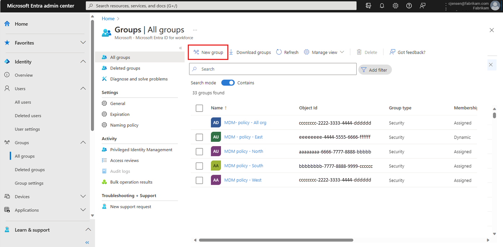

# Groups

> [!NOTE]
> This document is part of the Microsoft Entra ID section of my Azure Infrastructure Roadmap while preparing for the Microsoft AZ-104 certification.
> It explains how Microsoft Entra ID groups simplify identity management, access control, and governance across Azure and Microsoft 365.

---

## Group Lifecycle

```text
        Create Group
             │
             ▼
      Configure Group
             │
             ▼
      Add Members
             │
             ▼
 Assign Permissions
             │
             ▼
 Assign Licenses
             │
             ▼
 Manage Membership
             │
             ▼
 Delete Group
```

## Microsoft Entra Admin Center

Brief explanation...

<p align="center">
  
</p>

---

> [!TIP]
> **Key Concepts**
>
> - Groups are Security Principals.
> - Groups simplify permission management.
> - Azure RBAC permissions can be assigned to groups.
> - Membership can be static or dynamic.
> - Groups improve scalability and governance.

---

## Overview

Microsoft Entra ID groups allow administrators to organize users, devices, and other identities into logical collections.

Instead of assigning permissions, licenses, or policies individually, administrators assign them to groups.

Every member automatically inherits the assigned permissions or configurations.

Groups are fundamental for scalable identity management in enterprise environments.

---

## Why Groups Exist

Without groups, administrators would need to assign permissions individually to every user.

As organizations grow, this approach becomes difficult to maintain and increases the risk of configuration errors.

Groups centralize administration by allowing permissions, licenses, and policies to be managed once and automatically inherited by members.

---

## Group Types

Microsoft Entra ID supports several group types.

| Group Type | Purpose |
|------------|---------|
| Security Group | Access control and Azure RBAC assignments |
| Microsoft 365 Group | Collaboration across Microsoft 365 services |
| Mail-enabled Security Group | Security group with email capabilities (primarily Exchange scenarios) |

Each type is designed for different administrative and collaboration scenarios.

---

## Membership Types

Group membership can be configured in different ways.

| Membership | Description |
|------------|-------------|
| Assigned | Administrators manually add or remove members. |
| Dynamic User | Membership is calculated automatically using user attributes. |
| Dynamic Device | Membership is calculated automatically using device attributes. |

Dynamic membership helps automate administration in large organizations.

---

## Dynamic Membership

Dynamic groups use rule-based membership.

Instead of manually maintaining membership, Microsoft Entra ID evaluates directory attributes and automatically updates the group.

Example rule:

```text
(user.department -eq "IT")
```

Whenever a user's Department attribute changes, Microsoft Entra ID automatically updates the group membership.

---

## Group-Based Licensing

Microsoft recommends assigning Microsoft 365 licenses through groups instead of directly to individual users.

When users join or leave the group, licenses are assigned or removed automatically.

This greatly simplifies lifecycle management and reduces administrative effort.

---

## Azure RBAC Integration

Groups are commonly used together with Azure Role-Based Access Control (Azure RBAC).

Instead of assigning Azure roles directly to individual users, administrators assign roles to groups.

All group members inherit the assigned permissions.

This approach simplifies permission management and supports the principle of least privilege.

---

## Role-Assignable Groups

Role-assignable groups are special Microsoft Entra ID groups that can be assigned Microsoft Entra administrative roles.

They are used to manage privileged access through groups instead of assigning administrative roles directly to individual users.

Role-assignable groups require Microsoft Entra ID P1 or P2.

These groups must be created with role assignment capability enabled. This is represented by the `isAssignableToRole` property.

Role-assignable groups cannot use dynamic membership. Their membership must be assigned and carefully controlled to prevent unintended privilege escalation.

---

## Dynamic Group Considerations

Dynamic groups require the appropriate Microsoft Entra ID licensing.

Membership is calculated by Microsoft Entra ID based on rules and directory attributes.

Dynamic membership updates are not always immediate. In large tenants or complex rules, processing can take longer.

Dynamic groups are useful for automation, but they should not be used for scenarios where access must change instantly.

---

## Nested Groups

Microsoft Entra ID supports adding groups as members of other groups in some scenarios.

Nested groups can simplify membership management, but their behavior depends on the service using the group.

For example, nested group membership can be useful for access evaluation in some scenarios, but not all Microsoft services expand nested memberships in the same way.

Administrators should verify whether the target service supports nested groups before relying on them for access, licensing, or application assignments.

---

## Group Expiration

Microsoft 365 Groups can use expiration policies to reduce unused or abandoned groups.

When a group reaches its expiration period, owners can renew it.

If the group is not renewed, it can be deleted and later recovered during the soft-delete period.

This helps keep the directory clean and reduces governance risks caused by unmanaged groups.

---

## Enterprise Scenario

A company has 300 IT employees.

Instead of assigning the **Virtual Machine Contributor** role individually, administrators create an **IT Operations** security group.

The Azure RBAC role is assigned once to the group.

Whenever a new administrator joins the department, adding the user to the group automatically grants the required Azure permissions.

Microsoft 365 licenses are also assigned through dedicated licensing groups.

---

## Best Practices

- Assign permissions to groups instead of individual users.
- Use dynamic membership when appropriate.
- Use meaningful group names.
- Separate licensing groups from permission groups when appropriate.
- Regularly review group membership.
- Remove unused groups.

---

## Common Pitfalls

- Assigning permissions directly to users.
- Creating too many overlapping groups.
- Forgetting to review dynamic membership rules.
- Mixing licensing and administrative purposes without planning.
- Leaving obsolete groups in the directory.

---

> [!IMPORTANT]
> **AZ-104 Focus**
>
> You should understand:
>
> - Security Groups
> - Microsoft 365 Groups
> - Dynamic Groups
> - Assigned membership
> - Dynamic membership
> - Azure RBAC with groups
> - Group-based licensing
> - Group lifecycle

---

## Key Takeaways

- Groups are Security Principals.
- Groups simplify identity management.
- Azure RBAC permissions can be assigned to groups.
- Dynamic groups automate membership.
- Group-based licensing reduces administrative effort.
- Groups improve governance and scalability.

---

## References

| Microsoft Documentation | Purpose |
|-------------------------|---------|
| https://learn.microsoft.com/entra/fundamentals/concept-learn-about-groups | Microsoft Entra ID groups overview |
| https://learn.microsoft.com/entra/identity/users/groups-create-rule | Dynamic membership rules |
| https://learn.microsoft.com/entra/fundamentals/concept-group-based-licensing | Group-based licensing |
| https://learn.microsoft.com/azure/role-based-access-control/overview | Azure RBAC |
| https://learn.microsoft.com/training/modules/explore-basic-services-identity-types/ | Microsoft Learn – Identity types |
